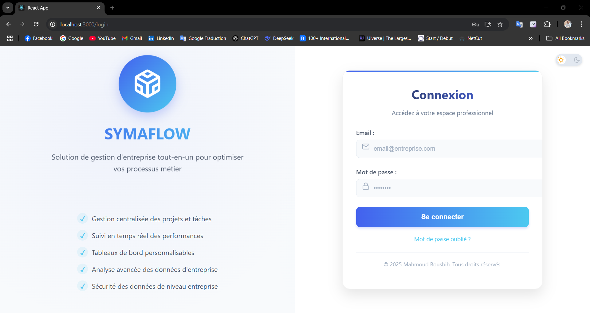
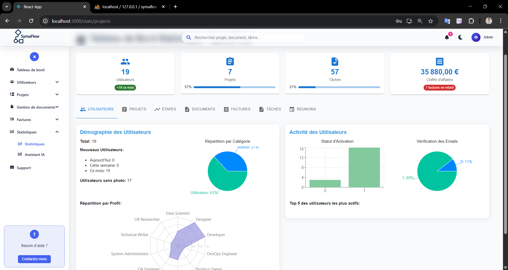
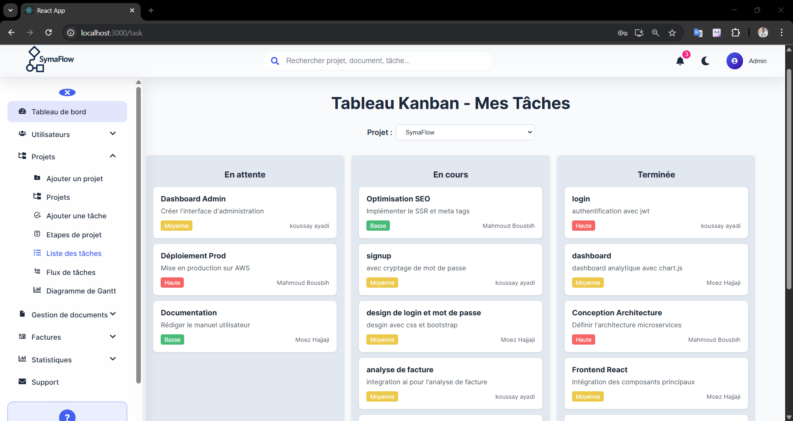
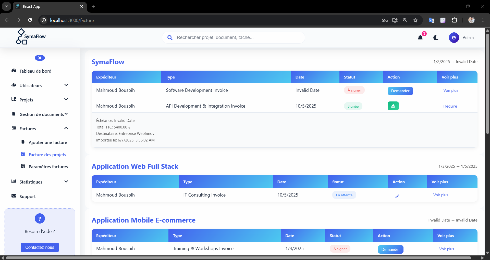

# 🚀 SymaFlow – Project & Workflow Management Platform  
SymaFlow est une plateforme complète de gestion de projets, intégrant une application **Web**, une application **Mobile**, et un **service IA** pour l’analyse des données et la prédiction d’avancement.  
Elle permet aux équipes (Admin, Chefs de projets, Développeurs, Designers, Testeurs…) de collaborer efficacement grâce à un ensemble d’outils modernes.

---

## 📌 Table des matières
- [🎯 Objectif du projet](#-objectif-du-projet)
- [🏗️ Architecture](#️-architecture)
- [👥 Rôles et utilisateurs](#-rôles-et-utilisateurs)
- [⚙️ Fonctionnalités](#️-fonctionnalités)
  - [Application Web](#application-web)
  - [Application Mobile](#application-mobile)
  - [Service IA](#service-ia)
- [🖼️ Captures d’écran](#️-captures-décran)
- [🛠️ Technologies](#️-technologies)
- [📦 Installation](#-installation)
- [📄 Licence](#-licence)

---

## 🎯 Objectif du projet
SymaFlow vise à offrir une solution **tout-en-un** pour :
- La gestion des projets  
- Le suivi des tâches  
- La gestion documentaire  
- La gestion des factures  
- La collaboration entre équipes  
- L’analyse intelligente via IA (Python + Flask)

---

## 🏗️ Architecture
symaflow/
│── backend/ → API Node.js + Express + MySQL
│── ml_service/ → Service IA (Python + Flask)
│── src/ → Application Web (React.js)
│── symaflow-mobile/ → Application Mobile (React Native - Expo)
│── docs/ → Images & documentation

---

## 👥 Rôles et utilisateurs

### 🟣 **Administrateur (Admin – Partie Web)**
- Gestion des utilisateurs et rôles  
- Gestion complète des projets  
- Gestion documentaire  
- Gestion des factures  
- Tableau de bord + statistiques avancées  
- Assistant IA d’analyse des données  
- Support interne  

### 🔵 **Chef de projet**
- Gestion des projets assignés  
- Gestion des tâches & membres  
- Suivi d'avancement & prédictions  
- Accès documents & factures  
- Messagerie support  

### 🟢 **Utilisateur (Développeur / Designer / Testeur…)**
- Voir tâches assignées  
- Mettre à jour le statut des tâches  
- Voir documents  
- Diagramme de Gantt  
- Support  

---

## ⚙️ Fonctionnalités

### 🖥️ **Application Web**
- Authentification & gestion comptes  
- Dashboard complet  
- Gestion des projets / membres / tâches  
- Gestion des documents  
- Gestion des factures (avec signature électronique)  
- Diagramme Gantt  
- Statistiques  
- Assistant IA pour l’analyse des données  
- Mode sombre 🌙  

### 📱 **Application Mobile**
- Vue projets & tâches  
- Ajout et mise à jour des tâches  
- Calendrier & réunions  
- Notifications  
- Support interne  

### 🤖 **Service IA**
- Analyse des données du projet  
- Prédiction du taux d’avancement  
- Détection des retards  
- Insights intelligents (Python + Flask)  

---

## 🖼️ Captures d’écran

### 🔐 **Authentification**

### 🏠 **Dashboard (Admin)**

### 📊 **Statistiques**

### 📄 **Ajouter un document**

### 📌 **Ajouter une tâche**

### 📁 **Tâche**

### 🔁 **Flow des tâches**

### 🧠 **Assistant IA**

### 📈 **Diagramme de Gantt**

### 🧾 **Factures**

### 🧱 **Étapes du projet**

### 🌙 **Mode Sombre**

---

## 🛠️ Technologies utilisées

### **Backend**
- Node.js  
- Express  
- MySQL  
- JWT  
- Multer  

### **IA**
- Python  
- Flask  
- NumPy / Pandas / Scikit-learn  

### **Web**
- React.js  
- Redux Toolkit  
- Axios  

### **Mobile**
- React Native (Expo)  
- React Navigation  

---

## 📦 Installation

### 1️⃣ Lancer le Backend
bash
cd backend
npm install
npm start

2️⃣ Lancer le service IA
cd ml_service
pip install -r requirements.txt
python app.py

3️⃣ Lancer la partie Web
cd src
npm install
npm start

4️⃣ Lancer l’application Mobile
cd symaflow-mobile
npm install
expo start

📄 Licence

Projet développé à des fins académiques et professionnelles.
© 2025 Mahmoud Bousbih.
